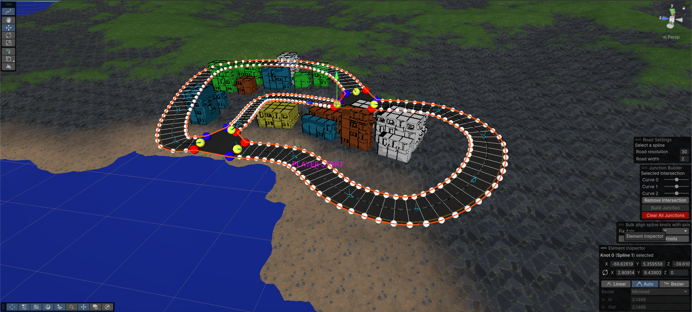

# Spline Road Utils

This package contains a set of utilities to generate a road network starting from Unity Splines and connect them through junctions.

It is basically an implementation of [this tool](https://www.youtube.com/watch?v=ZiHH_BvjoGk&list=LL&ab_channel=GameDevGuide) with some additional features.

## Original Features

- Multi spline road mesh generation
- Junction mesh generation
- Dynamic UV-Mapping

## Additional Features

- Selective junction removal - To remove a single junction or all junctions from a road network
- Overridable resolution for each road segment - to specify a different mesh density for a specific road segment
- Overridable width for each road segment - to reduce and increase the size of a specific road segment
- Spline alignment along a specific asset - to ensure that all spline knots are properly facing a specific direction
- Terrain to spline mesh conformation - to ensure a terrain adapts to accomodate the road without overlapping

## Requirements

- Unity 6000.0+

**Note** it may work on previous unity versions too. I simply did not test them yet

## Installation

- Open Unity
- Click on **Windows** -> **Package Manager**
- Click on **+** -> **Install package from git URL**
- Paste this repo URL
- Click on **Install**

### Optional

- Install Samples from the Sample tab of the package

Samples contain a Demo Scene and a prefab of the RoadNetworkBuilder that you may want to use as a starting point to build your own road network