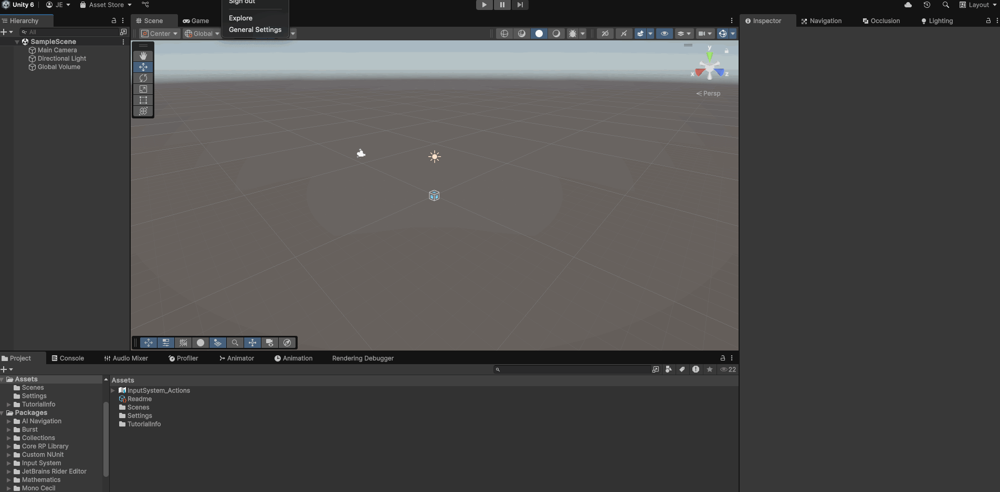
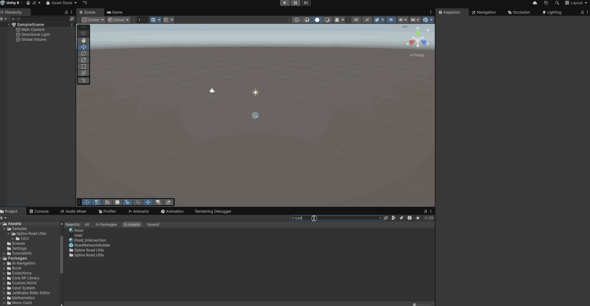
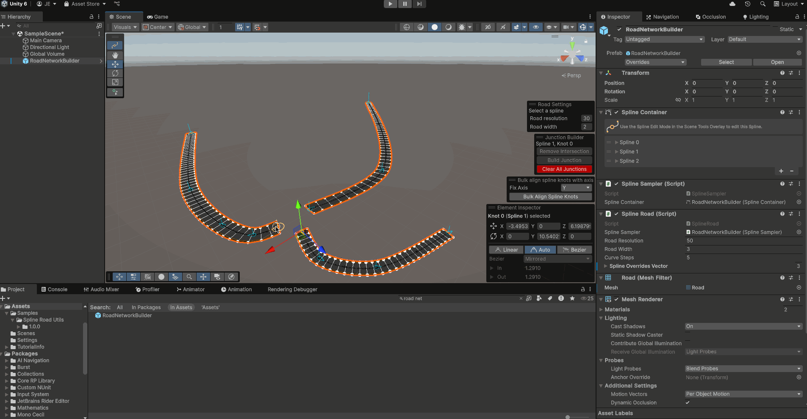
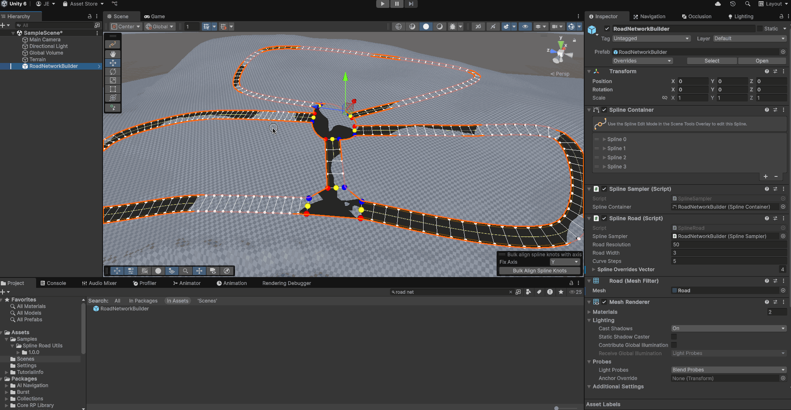
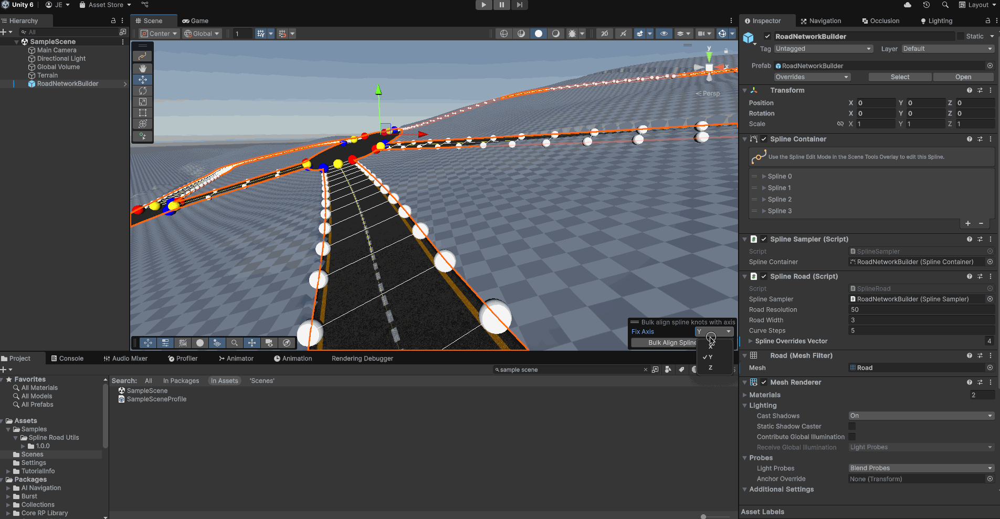

# Spline Road Utils

This package contains a set of utilities to generate a road network starting from Unity Splines and connect them through junctions.

It is basically an implementation of [this tool](https://www.youtube.com/watch?v=ZiHH_BvjoGk&list=LL&ab_channel=GameDevGuide) with some additional features I needed for my projects.

## Original Features

- Multi spline road mesh generation
- Junction mesh generation
- Dynamic UV-Mapping

## Additional Features

- Selective junction removal - To remove a single junction or all junctions from a road network
- Overridable resolution for each road segment - to specify a different mesh density for a specific road segment
- Overridable width for each road segment - to reduce and increase the size of a specific road segment
- Spline alignment along a specific asset - to ensure that all spline knots are properly facing a specific direction
- Terrain to spline mesh conformation - to ensure a terrain adapts to accomodate the road without overlapping

## Requirements

- Unity 6000.0+

**Note** it may work on previous unity versions too. I simply did not test them yet

## Installation

- Open Unity
- Click on **Windows** -> **Package Manager**
- Click on **+** -> **Install package from git URL**
- Paste this repo URL
- Click on **Install**

### Optional

- Install Samples from the Sample tab of the package

Samples contain a Demo Scene and a prefab of the RoadNetworkBuilder that you may want to use as a starting point to build your own road network

## Usage

### Quick Start

- Drag the `RoadNetworkBuilder` prefab into your scene and reset its position
- Activate the spline tool and draw a spline normally do generate the road
- Create multiple roads by clicking the Create Spline button in the scene toolbar
- Adjust a single road segment resolution and width by tweaking the Road Resolution and Road width parameters in the Road Settings overlay with a spline selected

### Creating and deleting a junction

- Ctrl or Cmd + Click to select all the nodes from the spline you wish to connect
- Click the `Build Junction` button to create a junction
- Adjust all edges curvature by tweaking the curve sliders with a junction selected
- To remove a junction just click the `Remove Intersection` button with one of the knots belonging to the instersection selected
- Use the `Clear All Junctions` button to clear all the intersections in the current road network.

### Conform terrains to the road network

This feature allow to conform the terrain below the road network so that it does not overlap with it.

- Ctrl or Cmd + Click the road network and the terrain game objects to select them simoultaneously 
- On the `Conform Terrain To Road` overlay set a desired Y-offset for the terrain and an edge falloff smoothness value
- Click conform to terrain to modify the terrain

### Align road system with an axis

If you wish you can force all splines knots to align with an axis to correct unwanted rotations

- Select the road network game object
- Select an aligment axis (tipically you want to align roads on the Y axis)
- Click on `Bulk Align Spline Knots`

**NOTE**: you may want to conform terrain with the roads again after changing the road aligment